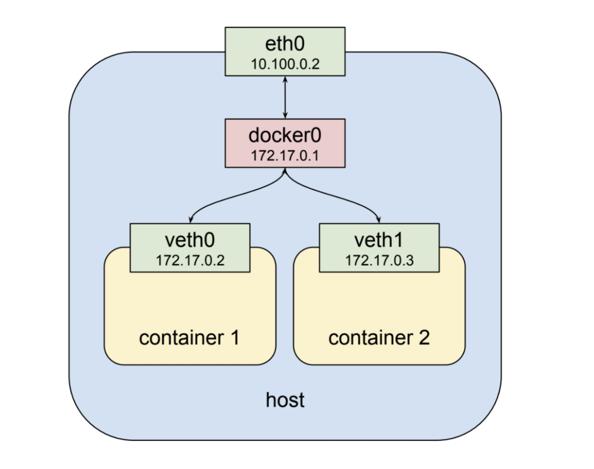
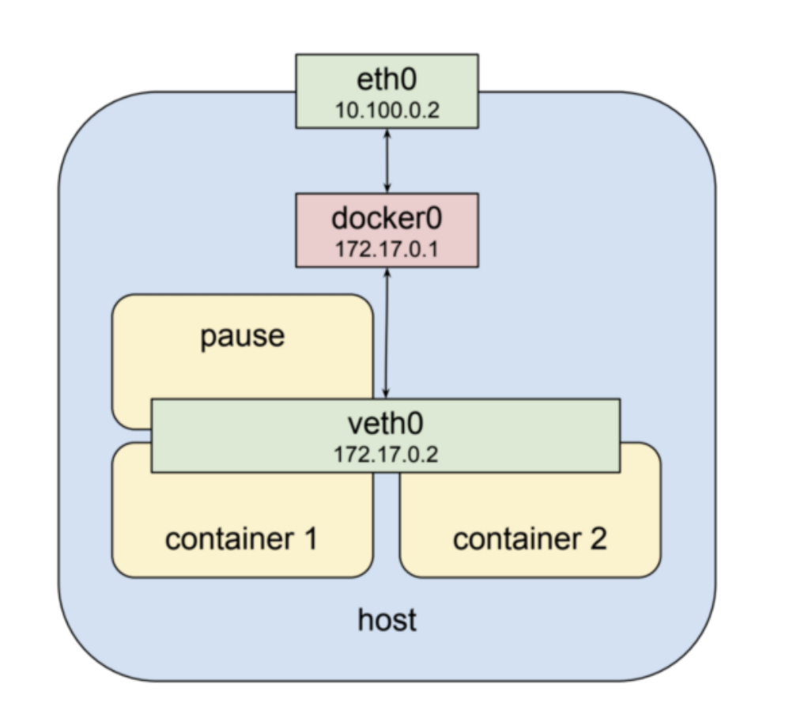
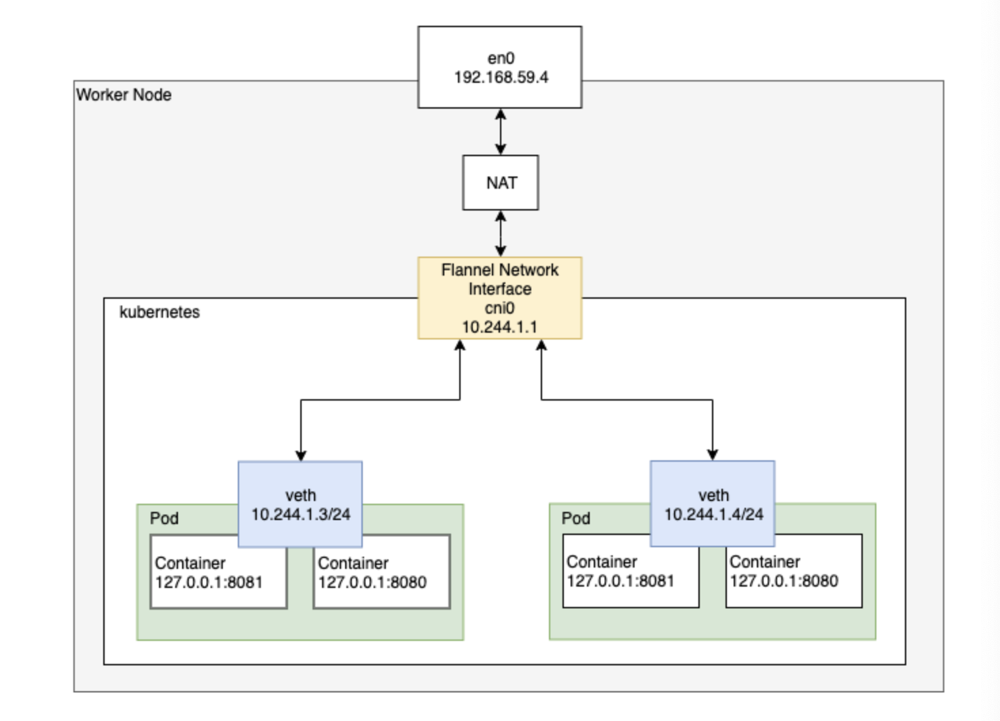

# ref

- https://medium.com/finda-tech/kubernetes-%EB%84%A4%ED%8A%B8%EC%9B%8C%ED%81%AC-%EC%A0%95%EB%A6%AC-fccd4fd0ae6

# Network

## 쿠버네티스 네트워크 모델

- 서로 결합된 컨테이너와 컨테이너 간 통신
- Pod와 Pod 간의 통신
- Pod와 Service간의 통신
- 외부와 Service간의 통신

## 서로 결합된 컨테이너와 컨테이너 간 통신

Docker에서는 기본적으로 같은 노드(host) 내의 컨테이너 끼리의 통신은 위의 그림과 같이 docker0 라는 가상 네트워크 인터페이스(172.17.0.0/24)를 통해 가능하다.

또한 각 컨테이너는 veth라는 가상 네트워크 인터페이스를 고유하게 가지며 따라서 각각의 veth IP 주소 값으로 통신할 수 있다.

아래 그림은 Kubernetes Pod 내의 컨테이너 끼리의 통신을 나타낸다. (하지만 Docker에서도 가능하다.)

위 그림에서 veth0 가상 네트워크 인터페이스에 두 개의 컨테이너가 동시에 할당되어 있다.

즉,두 개의 컨테이너는 모두 veth0 이라는 동일한 네트워크를 사용하는 것이다.

그렇다면 외부에서는 두 개의 컨테이너가 동일한 IP로 보일 텐데 각 컨테이너를 어떻게 구분할까?

**veth0** 안에서 각 컨테이너는 고유한 **port** 번호로 서로를 구분한다. 따라서 Pod 내에서 컨테이너는 각자 고유한 Port 번호를 사용해야 한다.

이러한 네트워크 인터페이스를 제공해주는 특별한 컨테이너 들이 있다.

Kubernetes Pod가 실행되고 있는 워커 노드에 들어가서 docker ps 명령어를 입력하면 적어도 한 개 이상의 pause라는 명령으로 실행된 컨테이너를 볼 수 있다.

이 특별한 컨테이너들은 각 Pod 마다 존재하며 다른 컨테인너들에게 네트워크 인터페이스를 제공하는 역할만 담당한다.

pause 명령으로 실행된 컨테이너는 kubernetes가 SIGTERM 명령을 내리기 전까지 아무것도 하지 않고 sleep 상태로 존재한다.

## Pod와 Pod 간의 통신

Pod to Pod

- 싱글 노드 Pod 네트워크

기본적으로 kubernetes는 kubenet이라는 아주 기본적이고 간단한 네트워크 플러그인을 제공해 주지만, 정말로 매우 기본적이고 간단한 기능만 제공해주는 네트워크 플러그인이기 때문에 이 자체로는 크소스 노드 네트워킹이나 네트워크 정책 설정과 같은 고급 기능은 구현되어 있지 않다.

따라서 kubernetes에서는 Pod 네트워킹 인터페이스로 CNI 스펙을 준수하는다야한 네트워크 플러그인을 사용ㅎ는 것을 권장한다. (kubernetes에서 제공해주는 클러스터 빌드 전용 커맨드라인 인터페이스인 kubeadm은 기본적으로 CNI기반 네트워크 플러그인만 사용할 수 있도록 되어있다.)

