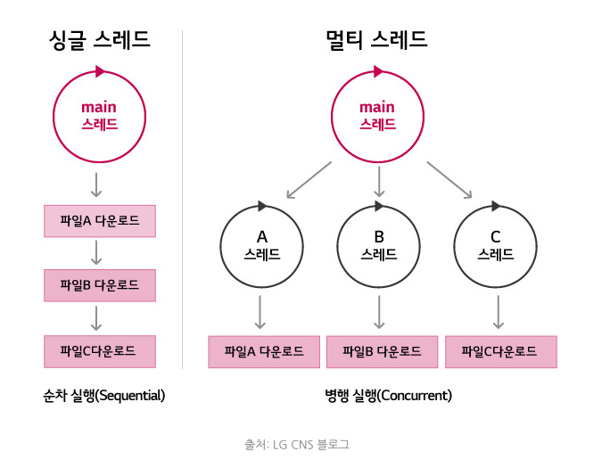

## ref
- https://m.blog.naver.com/jhc9639/220967352282
- https://blog.naver.com/jhc9639/221108496101?proxyReferer=https%3A%2F%2Fm.blog.naver.com%2Fjhc9639%2F220967352282

# nginx

## 동기와 비동기의 정의

동기라는 것은 어떤 일이 끝나고 나서 순차적으로 일을 진행하는 것을 말하고 비동기의 경우, 어떤 일이 안끝났어도 할일을 계속해서 진행하는 것을 말한다.
다시 말해, 동기는 A와 B일이 벌어졌을 때 A가 끝나고 B가 끝나는 방식이고, 비동기는 A와 B가 벌어졌을때 두개가 동시에 벌어지며, 둘 중에 좀 더 빨리 끝나는 일이 먼저 끝나는 즉, A와 B가 순차적으로 벌어져도 결과가 B가 나오고 A가 나올 수도 있는 것을 말한다.

코드를 짤 때는 동기방식이 가독성이 좋다.

하지만 비동기는 어려운 편이다. "비동기 방식의 코드"가 완료되면 callback이 호출되고 그 callback 함수 안에서 로직을 구성해야 한다. 즉, 비동기는 동기보다 복잡하고 구현하기도 어렵지만 "비동기 방식의 코드"는 node.js가 높은 성능으로 반겨준다.

## node.js와 비동기방식

그렇다면, 비동기 방식은 어떻게 좋은 걸까?
비동기방식은 동기방식의 "멀티쓰레드" 서버의 문제점을 해결하는데 있어서 좋다. 클라이언트의 요청이 많은 경우, 서버는 병목 현상이 발생하게 되며 이를 해결하기 위해 "쓰레드"를 늘려 "멀티쓰레드"로 해결하게 되는데 서버의 자원은 한정되어 있기 때문에 "한계"가 발생하게 된다. 그러나, Node.js는 비동기 방식을 적용한 "싱글쓰레드"로 해결가능하다.

동기 방식의 싱글 스레드와 멀티 스레드는 아래와 같다.

하지만 이렇게 되면 "자원의 한계"에 부딪히게 된다. 파일 하나 더 다운 받을 때마다 쓰레드를 늘려야 하니깐 말이다.

node.js의 비동기방식의 싱글스레드는 아래와 같다.

## nginx

트래픽이 많은 웹사이트를 위해 확장성을 위해 설계한 비동기 이벤트 기반구조의 웹서버 소프트웨어이다. **더 적은 자원으로 더 빠르게 서비스**를 가능하게 해준다. 이 프로그램은 가벼움과 높은 성능을 목표로 만들어 졌으며, 러ㅣㅅ아의 프로그래머 이고르 시쇼브가 Apache의 C10K Problem(하나의 웹서버에 10,000개의 클라이언트의 접속을 동시에 다룰 수 있는 기술적인 문제)를 해결하기 위해 만든 Event-driven 구조의 HTTP, Reverse Proxy, IMAP/POP PROXY server를 제공하는 오픈소스 서버 프로그램이다.

- Apache와 Nginx 비교

주로 Nginx는 Apache와 비교를 많이 당합니다. 예전에는 Apache 서버를 많이 썼습니다만 지금은 많이 달라졌습니다. 2018년 5월 기준, nginx는 23%, Apache는 25%를 차지한다.

- Apache
  - 쓰레드 / 프로세스 기반 구조로 요청 하나당 쓰레드 하나가 처리하는 구조
  - 사용자가 많으면 많은 쓰레드 생성, 메모리 및 CPU 낭비가 심함
  - 하나의 쓰레드 : 하나의 클라이언트 라는 구조

- nginx
  - 비동기 Event-Driven 기반 구조
  - 다수의 연결을 효과적으로 처리가능
  - 대부분의 코어 모듈이 Apache 보다 적은 리소스로 더 빠르게 동작 가능
  - 더 작은 쓰레드로 클라이언트의 요청을 처리 가능

- 쓰레드와 Event-driven

쓰레드 기반은 하나의 커넥션당 하나의 쓰레드를 잡아 먹지만 이벤트 드라이븐 방식은 여러개의 커넥션을 몽땅 다 Event Handler를 통해 비동기 방식으로 처리해 먼저 처리되는 것부터 로직이 진행되게끔 한다.